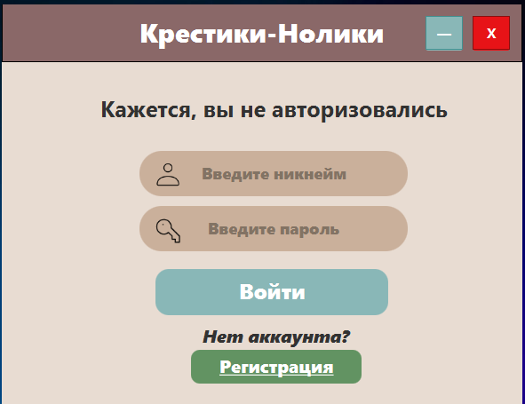
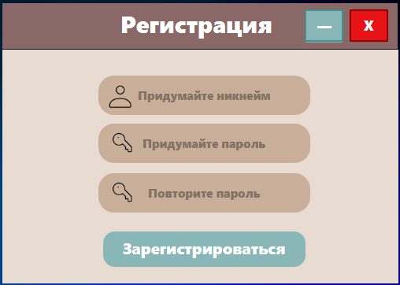
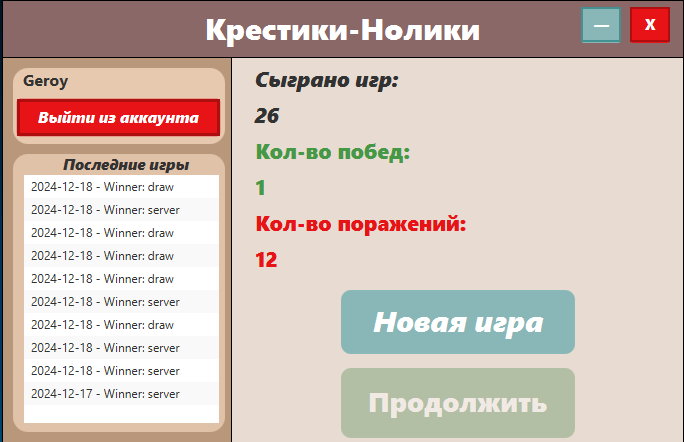
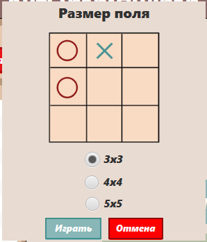
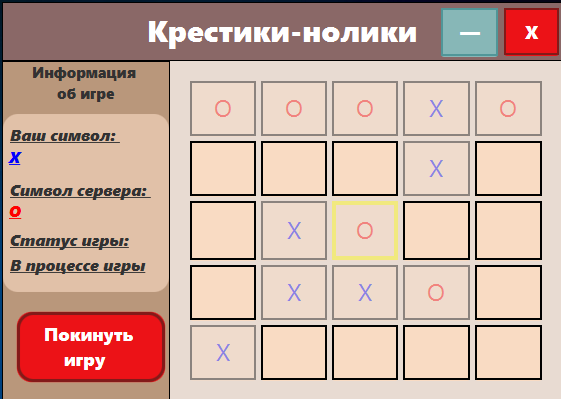

# Tic-Tac-Toe: Client-Server Application

## Description
This project is a client-server implementation of the classic Tic-Tac-Toe game with advanced features. The application allows users to play Tic-Tac-Toe against the computer (server) with multiple grid size options. It also provides a user-friendly interface for managing accounts and tracking game statistics.

---

## Features

### User Management:
- **Registration**: Create a new user account with a unique username and password.
- **Authorization**: Log in with your credentials to access your account.

### Game Features:
- **Grid Size Selection**: Choose between 3x3, 4x4, and 5x5 grids for gameplay.
- **Play Against Server**: Compete against an AI-powered server.
- **Game Statistics**: View your wins, losses, and total games played.

---

## Screenshots

### 1. Authorization Page


### 2. Registration Page


### 3. Main Menu


### 4. Grid Size Selection


### 5. Game Screen


---

## Installation Instructions

### Step 1: Database Setup
1. Navigate to the `database` folder.
2. Execute the provided SQL script to create the necessary database structure.
   ```bash
   mysql -u username -p < database/create_database.sql
   ```

### Step 2: Start the Server
1. Navigate to the `Server` folder.
2. Compile and run the server application.
   ```bash
   javac ServerMain.java
   java ServerMain
   ```

### Step 3: Launch the Client Application
1. Navigate to the `application` folder.
2. Compile and run the JavaFX client application.
   ```bash
   javac MainApp.java
   java MainApp
   ```

---

## Technologies Used
- **Java**: Core language for the client and server.
- **JavaFX**: For building the graphical user interface.
- **MySQL**: Database for storing user data and game statistics.

---
